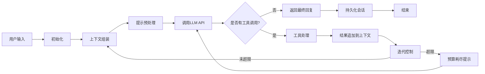

# 3. Agent 核心循环

Agent 核心循环是 Hermes Agent 处理对话的核心流程，所有用户请求都通过这个循环处理，实现多轮对话、工具调用、上下文管理等核心能力。

## 概述

核心循环是一个同步的迭代执行流程，从接收用户输入开始，循环调用 LLM 和执行工具，直到模型返回最终回复或者达到迭代上限。整个流程设计确保了稳定性、可观测性和成本可控。

## 对话处理完整流程

### 详细步骤说明

#### 1. 初始化
- 加载用户配置和环境变量
- 初始化对应模型提供商的 LLM 客户端
- 自动发现所有可用的工具，生成工具 Schema 列表
- 初始化上下文压缩器和提示词缓存实例
- 分配唯一的会话 ID，初始化统计指标（Token 用量、迭代次数等）

#### 2. 上下文组装
按顺序组装完整的上下文消息列表：
1. 系统提示词：包含核心指令、技能描述、工具说明、平台规则等
2. 历史消息：用户和助手的历史对话、工具调用和结果
3. 当前用户输入：用户最新的请求
4. 上下文文件：用户指定的需要参考的本地文件内容
5. 平台专属提示：不同平台的特殊规则和指令

#### 3. 提示预处理
- 为提示词添加缓存标记，启用提示词缓存优化
- 预估当前上下文的 Token 用量
- 判断是否需要触发上下文压缩（Token 用量超过阈值时自动触发）
- 清理上下文中的非法字符和格式错误，避免 API 调用失败

#### 4. LLM API 调用
- 根据模型配置选择对应的提供商客户端
- 支持流式输出和非流式输出两种模式
- 处理 API 限流、超时、鉴权失败等错误，自动重试
- 统计 Token 用量，更新会话统计信息
- 支持回调函数，实时返回响应内容给用户

#### 5. 响应处理
- 解析 LLM 返回的响应内容，提取文本回复和工具调用
- 如果没有工具调用，直接将回复返回给用户，结束流程
- 如果有工具调用，进入工具处理流程

#### 6. 工具处理
- 校验工具名称是否在可用工具列表中，过滤不可用的工具调用
- 根据工具 Schema 自动转换参数类型（字符串转数字、布尔值等）
- 判断工具是否可以并行执行，符合条件的工具并行执行提高效率
- 执行工具，捕获所有异常，统一格式化为错误信息
- 对大体积的工具结果自动截断或保存到临时文件，避免 Token 浪费

#### 7. 结果追加到上下文
将工具执行结果按照 LLM 要求的格式追加到上下文消息列表中，进入下一轮循环。

#### 8. 迭代控制
- 迭代次数加 1，检查是否超过最大迭代上限（默认 90 次）
- 检查 Token 用量是否超过压缩阈值，触发自动上下文压缩
- 如果达到上限，注入预算耗尽提示，要求模型总结最终结果

## 工具调用处理逻辑

### 并行执行判断规则
工具默认串行执行，只有同时满足以下条件的工具才会并行执行：
1. 工具在 `_PARALLEL_SAFE_TOOLS` 列表中：只读、无副作用的工具，比如文件读、网络搜索、网页抓取等
2. 不在 `_NEVER_PARALLEL_TOOLS` 列表中：需要用户交互、有副作用的工具，比如用户确认、文件写入、终端命令等
3. 文件类工具操作的路径没有冲突，不会互相影响

### 执行流程
- **可并行执行**：使用 `ThreadPoolExecutor` 并行执行多个工具调用，提高响应速度
- **不可并行执行**：按照工具返回的顺序串行执行，确保执行顺序正确
- **异常处理**：所有工具执行的异常都会被捕获，返回结构化的错误信息给模型，不会中断整个对话流程
- **结果格式化**：所有工具结果统一格式化为 JSON 字符串，确保模型可以正确解析

## 错误处理机制

核心循环设计了完善的错误处理机制，确保各种异常情况都能被优雅处理，不会导致系统崩溃或对话中断。

### API 错误分类处理
| 错误类型 | 处理策略 |
|----------|----------|
| 限流错误（429） | 指数退避重试，最多重试 3 次 |
| 超时错误 | 重试 1 次，仍然超时则降级到备用模型 |
| 上下文超限错误 | 自动触发上下文压缩，重试调用 |
| 鉴权失败错误 | 直接返回错误信息给用户，提示检查 API 密钥 |
| 模型不存在错误 | 提示用户切换到可用的模型 |
| 服务不可用错误 | 降级到备用模型，无备用模型则返回错误信息 |

### 工具执行错误处理
- 所有工具执行的异常都会被捕获，不会向上抛出
- 异常信息格式化为统一的 JSON 错误格式返回给模型
- 模型可以根据错误信息调整参数重试，或者告知用户错误原因
- 严重错误（比如沙箱崩溃、系统资源耗尽）会直接返回给用户，终止当前工具调用

### 安全输出处理
- 所有输出内容都会经过非法字符清理，防止破坏 JSON 格式或终端显示
- 敏感信息（API 密钥、密码等）会自动脱敏，不会出现在输出中
- 终端输出会自动过滤控制字符，防止终端显示异常

## 迭代控制逻辑

### 迭代预算
- 主会话默认最大迭代次数：90 次工具调用
- 子代理（delegate 工具创建）默认最大迭代次数：50 次
- 可以通过配置调整最大迭代次数，或者在 API 调用时指定

### 预算耗尽处理
- 当迭代次数达到上限时，自动注入预算耗尽提示：`迭代次数已达上限，请总结当前结果并返回最终回复`
- 强制模型输出最终回复，不再允许工具调用
- 避免无限循环导致的 Token 浪费和资源消耗

### 迭代退还机制
部分无副作用的工具（比如代码执行工具、文件读取工具）的迭代次数可以退还，不会占用预算，鼓励模型使用这些工具验证结果。

### Token 预算控制
除了迭代次数限制，还支持 Token 用量预算控制：
- 配置最大 Token 用量上限，达到上限后自动触发总结
- 实时统计 Token 用量，包括缓存命中的 Token
- 支持按照费用预算控制，达到预估费用上限后自动停止
