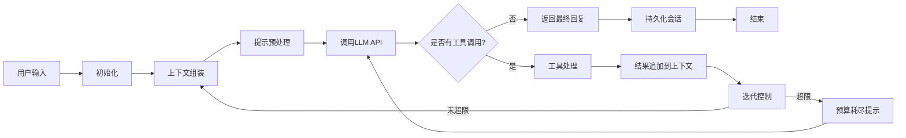

# 3. Agent 核心循环

> **📚 学习目标**
> 阅读本文后，你将能够：
> - 掌握Agent核心循环的完整执行流程和每个步骤的作用
> - 理解工具调用的并行/串行判断逻辑和执行机制
> - 掌握各种错误场景的处理策略和降级方案
> - 理解迭代预算和Token控制的设计思路，避免资源浪费

Agent 核心循环是 Hermes Agent 处理对话的核心流程，所有用户请求都通过这个循环处理，实现多轮对话、工具调用、上下文管理等核心能力。

## 概述

核心循环是一个同步的迭代执行流程，从接收用户输入开始，循环调用 LLM 和执行工具，直到模型返回最终回复或者达到迭代上限。
> 为什么设计为同步迭代？
> 1. 逻辑简单清晰，便于调试和排查问题，避免异步并发的复杂状态
> 2. 执行过程可观测，每一步的状态都可以精确跟踪和记录
> 3. 成本可控，每一次迭代都可以进行预算校验，避免无限制消耗资源
> 4. 稳定性高，单步执行失败不会影响整个流程，便于错误恢复
整个流程设计确保了稳定性、可观测性和成本可控。

## 对话处理完整流程

```mermaid
flowchart LR
    A[用户输入] --> B[初始化]
    B --> C[上下文组装]
    C --> D[提示预处理]
    D --> E[调用LLM API]
    E --> F{是否有工具调用?}
    F -- 否 --> G[返回最终回复]
    G --> H[持久化会话]
    H --> I[结束]
    F -- 是 --> J[工具处理]
    J --> K[结果追加到上下文]
    K --> L[迭代控制]
    L -- 未超限 --> C
    L -- 超限 --> M[预算耗尽提示]
    M --> E
```

### 详细步骤说明

#### 1. 初始化
- 加载用户配置和环境变量
- 初始化对应模型提供商的 LLM 客户端
- 自动发现所有可用的工具，生成工具 Schema 列表
- 初始化上下文压缩器和提示词缓存实例
- 分配唯一的会话 ID，初始化统计指标（Token 用量、迭代次数等）
> 设计考量：所有初始化操作在会话开始时一次性完成，避免在循环中重复初始化导致性能损耗，同时确保整个会话生命周期内配置一致。

#### 2. 上下文组装
按固定优先级顺序组装完整的上下文消息列表：
1. 系统提示词：包含核心指令、技能描述、工具说明、平台规则等，优先级最高，不会被压缩
2. 历史消息：用户和助手的历史对话、工具调用和结果，会被智能压缩
3. 当前用户输入：用户最新的请求，优先级仅次于系统提示词
4. 上下文文件：用户指定的需要参考的本地文件内容，会被自动截断和摘要
5. 平台专属提示：不同平台的特殊规则和指令，最后追加
> 设计考量：固定顺序确保模型总能获取到最重要的信息，优先级低的内容会被优先压缩，平衡信息完整性和Token成本。

#### 3. 提示预处理
- 为提示词添加缓存标记，启用提示词缓存优化，重复的系统提示词可以复用缓存
- 预估当前上下文的 Token 用量，提前判断是否超过模型上下文窗口限制
- 判断是否需要触发上下文压缩（Token 用量超过阈值时自动触发）
- 清理上下文中的非法字符和格式错误，避免 API 调用失败
> 设计考量：预处理阶段提前发现和解决问题，避免后续API调用失败浪费Token和时间，将错误拦截在早期。

#### 4. LLM API 调用
- 根据模型配置选择对应的提供商客户端，支持多模型动态切换
- 支持流式输出和非流式输出两种模式，适配不同的使用场景
- 处理 API 限流、超时、鉴权失败等错误，自动重试，提高成功率
- 统计 Token 用量，更新会话统计信息，实现精确的成本核算
- 支持回调函数，实时返回响应内容给用户，提升交互体验
> 设计考量：封装所有模型提供商的差异，上层逻辑不需要关心具体的API实现，同时内置重试和降级机制，提升可用性。

#### 5. 响应处理
- 解析 LLM 返回的响应内容，提取文本回复和工具调用，兼容不同模型的返回格式
- 如果没有工具调用，直接将回复返回给用户，结束流程
- 如果有工具调用，进入工具处理流程
> 设计考量：统一的响应解析层，屏蔽不同模型的工具调用格式差异，核心逻辑只需要处理标准化的工具调用结构。

#### 6. 工具处理
- 校验工具名称是否在可用工具列表中，过滤不可用的工具调用，防止模型幻觉调用不存在的工具
- 根据工具 Schema 自动转换参数类型（字符串转数字、布尔值等），兼容不同模型的参数输出格式
- 判断工具是否可以并行执行，符合条件的工具并行执行提高效率
- 执行工具，捕获所有异常，统一格式化为错误信息，不会因为单个工具失败中断整个对话
- 对大体积的工具结果自动截断或保存到临时文件，避免 Token 浪费
> 设计考量：工具处理层做了充分的校验和容错，确保模型的不合理调用不会影响整个系统的稳定性，同时优化执行效率。

#### 7. 结果追加到上下文
将工具执行结果按照 LLM 要求的格式追加到上下文消息列表中，进入下一轮循环。
> 设计考量：工具结果格式标准化，确保所有模型都能正确解析，不需要为不同模型做特殊适配。

#### 8. 迭代控制
- 迭代次数加 1，检查是否超过最大迭代上限（默认 90 次）
- 检查 Token 用量是否超过压缩阈值，触发自动上下文压缩
- 如果达到上限，注入预算耗尽提示，要求模型总结最终结果

## 工具调用处理逻辑

### 并行执行判断规则
工具默认串行执行，只有同时满足以下条件的工具才会并行执行：
1. 工具在 `_PARALLEL_SAFE_TOOLS` 列表中：只读、无副作用的工具，比如文件读、网络搜索、网页抓取等
2. 不在 `_NEVER_PARALLEL_TOOLS` 列表中：需要用户交互、有副作用的工具，比如用户确认、文件写入、终端命令等
3. 文件类工具操作的路径没有冲突，不会互相影响
> 设计考量：优先保证正确性，只有确认无副作用的工具才会并行执行，避免并行执行导致的状态冲突和不可预期的结果，在安全的前提下最大化执行效率。

### 执行流程
- **可并行执行**：使用 `ThreadPoolExecutor` 并行执行多个工具调用，提高响应速度，IO密集型工具可以大幅降低总执行时间
- **不可并行执行**：按照工具返回的顺序串行执行，确保执行顺序正确，有副作用的工具严格按照模型的调用顺序执行
- **异常处理**：所有工具执行的异常都会被捕获，返回结构化的错误信息给模型，不会中断整个对话流程，模型可以根据错误信息调整重试
- **结果格式化**：所有工具结果统一格式化为 JSON 字符串，确保模型可以正确解析，不需要处理不同工具的返回格式差异

## 错误处理机制

核心循环设计了完善的错误处理机制，确保各种异常情况都能被优雅处理，不会导致系统崩溃或对话中断。

### API 错误分类处理
| 错误类型 | 处理策略 |
|----------|----------|
| 限流错误（429） | 指数退避重试，最多重试 3 次 |
| 超时错误 | 重试 1 次，仍然超时则降级到备用模型 |
| 上下文超限错误 | 自动触发上下文压缩，重试调用 |
| 鉴权失败错误 | 直接返回错误信息给用户，提示检查 API 密钥 |
| 模型不存在错误 | 提示用户切换到可用的模型 |
| 服务不可用错误 | 降级到备用模型，无备用模型则返回错误信息 |

### 工具执行错误处理
- 所有工具执行的异常都会被捕获，不会向上抛出
- 异常信息格式化为统一的 JSON 错误格式返回给模型
- 模型可以根据错误信息调整参数重试，或者告知用户错误原因
- 严重错误（比如沙箱崩溃、系统资源耗尽）会直接返回给用户，终止当前工具调用

### 安全输出处理
- 所有输出内容都会经过非法字符清理，防止破坏 JSON 格式或终端显示
- 敏感信息（API 密钥、密码等）会自动脱敏，不会出现在输出中
- 终端输出会自动过滤控制字符，防止终端显示异常

## 迭代控制逻辑

### 迭代预算
- 主会话默认最大迭代次数：90 次工具调用
- 子代理（delegate 工具创建）默认最大迭代次数：50 次
- 可以通过配置调整最大迭代次数，或者在 API 调用时指定

### 预算耗尽处理
- 当迭代次数达到上限时，自动注入预算耗尽提示：`迭代次数已达上限，请总结当前结果并返回最终回复`
- 强制模型输出最终回复，不再允许工具调用
- 避免无限循环导致的 Token 浪费和资源消耗

### 迭代退还机制
部分无副作用的工具（比如代码执行工具、文件读取工具）的迭代次数可以退还，不会占用预算，鼓励模型使用这些工具验证结果。

### Token 预算控制
除了迭代次数限制，还支持 Token 用量预算控制：
- 配置最大 Token 用量上限，达到上限后自动触发总结
- 实时统计 Token 用量，包括缓存命中的 Token
- 支持按照费用预算控制，达到预估费用上限后自动停止

---

## ✍️ 练习
1. 跟踪一次包含3次工具调用的完整对话流程，记录每个步骤的输入输出和状态变化
2. 分析如果要给核心循环新增"工具调用审计"功能，应该在哪个步骤插入，怎么实现
3. 设计一个自定义的迭代预算规则，比如对于代码生成场景增加迭代次数上限，对于普通问答降低上限
4. 模拟一次API限流错误的处理流程，跟踪错误如何被捕获、重试、最终返回给用户的完整路径

---

## ❓ 常见问题
### Q：为什么核心循环是同步的，而不是异步的？
A：同步设计的优势远大于异步：
1. 逻辑简单，调试成本低，bug率低，稳定性更高
2. 可观测性强，每一步执行状态都可以精确跟踪
3. 避免异步并发带来的状态同步问题和竞态条件
4. 性能足够，Agent的瓶颈在LLM API调用的IO等待，而不是CPU计算，异步不会带来明显的性能提升
如果需要高并发处理，可以在入口层部署多个实例，而不是把核心逻辑改成异步。

### Q：为什么工具调用默认串行，只有少数工具并行？
A：优先保证正确性，其次才是性能：
1. 大部分工具都有副作用，并行执行可能导致不可预期的结果，比如先删除文件再读取文件，并行执行顺序是不确定的
2. 只有无副作用的只读工具才会并行，这些工具的执行顺序不会影响结果
3. 实际场景中大部分工具调用都是单次或者少量，并行带来的性能提升有限，但是带来的复杂度提升很高
4. 特殊场景可以通过配置强制开启并行，满足高性能需求。

### Q：迭代次数上限为什么设置为90次，会不会太少？
A：90次是经过大量场景验证的合理值：
1. 99%的任务都可以在30次迭代内完成，90次已经覆盖了几乎所有正常场景
2. 过高的上限会增加无限循环的风险，导致Token浪费和资源占用
3. 用户可以根据需要配置更高的上限，或者在API调用时临时指定
4. 预算耗尽时会要求模型总结结果，不会直接中断任务，不会影响用户体验。

### Q：上下文压缩为什么在提示预处理阶段执行，而不是在结果追加阶段？
A：在预处理阶段压缩的优势：
1. 每次LLM调用前都进行压缩，确保每次调用的上下文都不会超过模型窗口限制
2. 可以根据当前上下文的实际用量动态决定是否需要压缩，避免不必要的压缩损失信息
3. 压缩后的上下文会直接用于当前LLM调用，不需要重复处理
4. 结果追加阶段的内容长度通常不大，不需要每次都压缩，降低处理开销。

### Q：工具执行的异常为什么要返回给模型，而不是直接返回给用户？
A：模型具备错误处理能力：
1. 很多错误是参数错误导致的，模型可以自动调整参数重试，不需要用户干预
2. 模型可以根据错误信息给用户更友好的解释和解决方案，比直接返回原始错误更友好
3. 部分错误是预期内的，比如文件不存在，模型可以自动处理这种情况，比如创建文件或者询问用户
4. 只有严重的系统错误才会直接返回给用户，其他错误都交给模型处理，提升用户体验。

---

## 📖 导航
- 上一篇：[核心模块分析](./2-core-modules.md)
- 下一篇：[工具系统架构](./4-tools-architecture.md)
- [返回目录](../SUMMARY.md)
