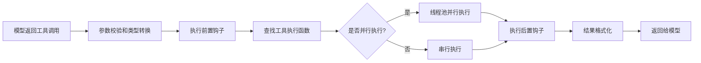

# 4. 工具系统架构

工具系统是 Hermes Agent 扩展能力的核心，采用可插拔设计，支持动态注册、自动发现、权限控制等能力，无需修改核心代码即可新增工具。

## 概述

工具系统采用三层架构设计，从下到上分别是注册层、实现层、编排层，各层职责明确，解耦性强：
- **注册层**：统一的工具注册中心，管理所有工具的元数据
- **实现层**：每个工具独立实现，自动注册到注册中心
- **编排层**：工具调度执行，负责工具发现、参数校验、执行控制、结果返回

## 工具注册流程

工具采用自动注册机制，新增工具不需要修改核心代码，只需要添加对应的实现文件即可。

### 注册步骤
```mermaid
flowchart LR
    A[创建工具实现文件 tools/xxx.py] --> B[实现工具函数、schema、检查函数]
    B --> C[调用 registry.register() 注册工具]
    C --> D[导入触发注册：model_tools.py 导入所有工具文件]
    D --> E[工具自动加入可用列表]
```

### 注册参数说明
注册工具时需要提供以下元数据：
```python
registry.register(
    name="工具唯一名称",
    tool_set="所属工具集", # core/file/terminal/web/browser等
    schema={ # OpenAI 格式的工具 Schema
        "name": "工具名称",
        "description": "工具功能描述",
        "parameters": {
            "type": "object",
            "properties": {
                "参数名": {"type": "类型", "description": "参数说明"}
            },
            "required": ["必填参数名"]
        }
    },
    handler=工具执行函数,
    check_fn=可用性检查函数, # 可选，返回bool表示工具是否可用
    requires_env=["依赖的环境变量名"], # 可选，缺少这些变量的工具自动隐藏
    icon="工具图标", # 可选，用于UI显示
    description="工具描述" # 可选
)
```

### 动态注册支持
除了启动时自动注册的内置工具，还支持运行时动态注册工具：
- MCP（Model Context Protocol）工具：运行时发现 MCP 服务器提供的工具，动态注册
- 插件工具：插件加载时动态注册自定义工具
- 临时工具：会话级别的临时工具，仅在当前会话中可用

## 工具调度执行流程

工具调用从模型返回开始，到结果返回给模型，经过完整的校验、执行、钩子处理流程。



### 详细步骤说明

#### 1. 参数校验和类型转换
- 根据工具 Schema 校验参数是否完整，必填参数是否缺失
- 自动转换参数类型，比如将字符串形式的数字转换为整数/浮点数，字符串转换为布尔值
- 校验参数格式是否符合要求，比如 URL 格式、路径格式等
- 参数校验失败返回错误信息给模型，要求修正参数

#### 2. 前置钩子执行
插件系统可以注册 `pre_tool_call` 钩子，在工具执行前做一些处理：
- 日志记录
- 权限校验
- 参数修改
- 执行拦截

#### 3. 工具查找和执行
- 从注册中心查找对应名称的工具执行函数
- 判断工具是否可以并行执行，符合条件的使用线程池并行执行
- 执行工具函数，传入参数和上下文信息
- 捕获所有执行异常，统一格式化为错误信息

#### 4. 后置钩子执行
插件系统可以注册 `post_tool_call` 钩子，在工具执行后做一些处理：
- 结果修改
- 日志记录
- 统计上报
- 安全审计

#### 5. 结果格式化
- 所有工具结果统一格式化为 JSON 字符串：
  - 成功：`{"success": true, "data": "结果内容"}`
  - 失败：`{"success": false, "error": "错误信息", "code": "错误码"}`
- 大体积结果自动截断，或者保存到临时文件，避免 Token 浪费
- 敏感信息自动脱敏，防止泄露

## 权限控制机制

工具系统提供多层权限控制，确保工具使用安全。

### 1. 工具集开关
启动时可以通过配置启用或禁用整个工具集：
```yaml
tools:
  enabled_toolsets:
    - core
    - file
    - web
  disabled_toolsets:
    - browser
    - terminal
```
禁用的工具集中的所有工具都会被隐藏，模型无法调用。

### 2. 单个工具开关
可以单独启用或禁用指定工具：
```yaml
tools:
  disabled_tools:
    - terminal_exec
    - file_write
```

### 3. 可用性检查
每个工具可以实现 `check_fn` 可用性检查函数，返回 False 时工具会被自动隐藏：
- 依赖的环境变量缺失时自动隐藏
- 依赖的第三方库未安装时自动隐藏
- 平台不支持时自动隐藏
- 权限不足时自动隐藏

### 4. 环境变量控制
敏感工具可以通过环境变量全局禁用：
```bash
HERMES_DISABLE_TERMINAL=true # 禁用所有终端相关工具
HERMES_DISABLE_CODE_EXEC=true # 禁用所有代码执行工具
HERMES_DISABLE_FILE_WRITE=true # 禁用所有文件写入工具
```

### 5. 网关级权限控制
消息网关可以按照用户/群组配置工具访问权限：
- 允许指定用户使用特定工具
- 禁止指定用户使用敏感工具
- 按照群组配置工具访问白名单

## 危险操作检测逻辑

工具系统内置危险操作检测机制，防止恶意操作导致系统损坏或数据泄露。

### 终端命令危险检测
终端执行工具会自动检测命令是否包含危险操作，匹配到危险模式的命令需要用户确认才能执行：
- 删除类命令：`rm`、`shred`、`unlink` 等
- 覆盖类命令：`mv`、`cp`、`sed -i`、`> 重定向` 等
- 系统修改类命令：`dd`、`mkfs`、`chmod -R 777 /` 等
- Git 危险操作：`git reset --hard`、`git clean -f`、`git checkout -- .` 等
- 网络攻击类命令：`nmap`、`nc`、`curl 恶意地址` 等

### 文件操作危险检测
文件操作工具会自动检测路径是否包含敏感路径：
- 系统目录：`/etc`、`/bin`、`/sbin`、`/usr` 等
- 敏感文件：`~/.ssh`、`~/.aws`、`~/.hermes/.env` 等
- 父目录遍历：`../` 路径遍历攻击检测
- 默认只允许访问当前工作目录及子目录，可以通过配置添加允许路径

### 浏览器工具危险检测
浏览器工具会自动检测访问的地址是否属于内网地址：
- 内网 IP 段：`10.0.0.0/8`、`172.16.0.0/12`、`192.168.0.0/16` 等
- 本地回环地址：`127.0.0.1`、`localhost`
- 云服务元数据地址：`169.254.169.254` 等
- 访问内网地址需要用户确认才能执行

### 代码执行危险检测
代码执行工具默认在隔离沙箱中运行：
- 禁止访问本地文件系统
- 禁止访问网络
- 限制 CPU 和内存使用
- 限制执行时间
- 禁止执行系统命令
