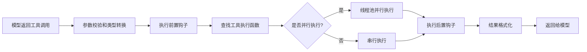

# 4. 工具系统架构

> **📚 学习目标**
> 阅读本文后，你将能够：
> - 理解工具系统的三层架构设计和各层的职责
> - 掌握工具注册的完整流程和参数含义
> - 理解工具调度执行的全流程和各个校验环节
> - 掌握工具系统的权限控制和安全检测机制，确保使用安全
> - 能够按照规范开发新的工具，符合系统设计要求

工具系统是 Hermes Agent 扩展能力的核心，采用可插拔设计，支持动态注册、自动发现、权限控制等能力，无需修改核心代码即可新增工具。

## 概述

工具系统采用三层架构设计，从下到上分别是注册层、实现层、编排层，各层职责明确，解耦性强：
- **注册层**：统一的工具注册中心，管理所有工具的元数据，是整个工具系统的基础，无任何外部依赖
- **实现层**：每个工具独立实现，自动注册到注册中心，工具之间互相独立，不互相依赖
- **编排层**：工具调度执行，负责工具发现、参数校验、执行控制、结果返回，是工具调用的入口
> 分层设计优势：
> 1. 各层独立演进，修改注册层不会影响工具实现，修改工具实现不会影响调度逻辑
> 2. 工具实现完全解耦，新增工具不需要修改其他层代码，降低接入成本
> 3. 便于测试，每层都可以独立测试，不需要依赖其他层
> 4. 支持多种工具来源，内置工具、MCP工具、插件工具都可以统一注册和调度

## 工具注册流程

工具采用自动注册机制，新增工具不需要修改核心代码，只需要添加对应的实现文件即可。
> 自动注册设计优势：
> 1. 新增工具零侵入，不需要修改核心代码，降低合并冲突风险
> 2. 工具可以独立开发、测试、发布，不需要和核心版本绑定
> 3. 可以通过控制导入的工具文件来控制加载哪些工具，实现动态开关
> 4. 便于第三方开发者贡献工具，不需要了解核心代码结构

### 注册步骤
```mermaid
flowchart LR
    A[创建工具实现文件 tools/xxx.py] --> B[实现工具函数、schema、检查函数]
    B --> C[调用 registry.register() 注册工具]
    C --> D[导入触发注册：model_tools.py 导入所有工具文件]
    D --> E[工具自动加入可用列表]
```

### 注册参数说明
注册工具时需要提供以下元数据：
```python
registry.register(
    name="工具唯一名称", # 全局唯一，不能和其他工具重名
    tool_set="所属工具集", # core/file/terminal/web/browser等，用于批量开关
    schema={ # OpenAI 格式的工具 Schema，严格符合官方规范
        "name": "工具名称",
        "description": "工具功能描述，要足够清晰，让模型理解什么时候调用这个工具",
        "parameters": {
            "type": "object",
            "properties": {
                "参数名": {"type": "类型", "description": "参数说明，明确参数的含义和格式要求"}
            },
            "required": ["必填参数名"]
        }
    },
    handler=工具执行函数, # 实际执行工具逻辑的函数
    check_fn=可用性检查函数, # 可选，返回bool表示工具是否可用，比如依赖的库是否安装
    requires_env=["依赖的环境变量名"], # 可选，缺少这些变量的工具自动隐藏，不会提供给模型
    icon="工具图标", # 可选，用于UI显示
    description="工具描述" # 可选，用于工具列表展示
)
```
> 参数设计考量：所有元数据都集中注册，便于统一管理和校验，不需要分散在不同的配置文件中，工具定义自包含，一个文件就是完整的工具实现。

### 动态注册支持
除了启动时自动注册的内置工具，还支持运行时动态注册工具：
- MCP（Model Context Protocol）工具：运行时发现 MCP 服务器提供的工具，动态注册，无需重启
- 插件工具：插件加载时动态注册自定义工具，扩展系统能力
- 临时工具：会话级别的临时工具，仅在当前会话中可用，适合自定义场景
> 动态注册设计优势：不需要重启系统即可扩展工具能力，适合云原生部署和插件化扩展场景。

## 工具调度执行流程

工具调用从模型返回开始，到结果返回给模型，经过完整的校验、执行、钩子处理流程。


```mermaid
flowchart LR
    A[模型返回工具调用] --> B[参数校验和类型转换]
    B --> C[执行前置钩子]
    C --> D[查找工具执行函数]
    E{是否并行执行?}
    D --> E
    E -- 是 --> F[线程池并行执行]
    E -- 否 --> G[串行执行]
    F --> H[执行后置钩子]
    G --> H
    H --> I[结果格式化]
    I --> J[返回给模型]
```

### 详细步骤说明

#### 1. 参数校验和类型转换
- 根据工具 Schema 校验参数是否完整，必填参数是否缺失
- 自动转换参数类型，比如将字符串形式的数字转换为整数/浮点数，字符串转换为布尔值
- 校验参数格式是否符合要求，比如 URL 格式、路径格式等
- 参数校验失败返回错误信息给模型，要求修正参数

#### 2. 前置钩子执行
插件系统可以注册 `pre_tool_call` 钩子，在工具执行前做一些处理：
- 日志记录
- 权限校验
- 参数修改
- 执行拦截

#### 3. 工具查找和执行
- 从注册中心查找对应名称的工具执行函数
- 判断工具是否可以并行执行，符合条件的使用线程池并行执行
- 执行工具函数，传入参数和上下文信息
- 捕获所有执行异常，统一格式化为错误信息

#### 4. 后置钩子执行
插件系统可以注册 `post_tool_call` 钩子，在工具执行后做一些处理：
- 结果修改
- 日志记录
- 统计上报
- 安全审计

#### 5. 结果格式化
- 所有工具结果统一格式化为 JSON 字符串：
  - 成功：`{"success": true, "data": "结果内容"}`
  - 失败：`{"success": false, "error": "错误信息", "code": "错误码"}`
- 大体积结果自动截断，或者保存到临时文件，避免 Token 浪费
- 敏感信息自动脱敏，防止泄露

## 权限控制机制

工具系统提供多层权限控制，确保工具使用安全。

### 1. 工具集开关
启动时可以通过配置启用或禁用整个工具集：
```yaml
tools:
  enabled_toolsets:
    - core
    - file
    - web
  disabled_toolsets:
    - browser
    - terminal
```
禁用的工具集中的所有工具都会被隐藏，模型无法调用。

### 2. 单个工具开关
可以单独启用或禁用指定工具：
```yaml
tools:
  disabled_tools:
    - terminal_exec
    - file_write
```

### 3. 可用性检查
每个工具可以实现 `check_fn` 可用性检查函数，返回 False 时工具会被自动隐藏：
- 依赖的环境变量缺失时自动隐藏
- 依赖的第三方库未安装时自动隐藏
- 平台不支持时自动隐藏
- 权限不足时自动隐藏

### 4. 环境变量控制
敏感工具可以通过环境变量全局禁用：
```bash
HERMES_DISABLE_TERMINAL=true # 禁用所有终端相关工具
HERMES_DISABLE_CODE_EXEC=true # 禁用所有代码执行工具
HERMES_DISABLE_FILE_WRITE=true # 禁用所有文件写入工具
```

### 5. 网关级权限控制
消息网关可以按照用户/群组配置工具访问权限：
- 允许指定用户使用特定工具
- 禁止指定用户使用敏感工具
- 按照群组配置工具访问白名单

## 危险操作检测逻辑

工具系统内置危险操作检测机制，防止恶意操作导致系统损坏或数据泄露。

### 终端命令危险检测
终端执行工具会自动检测命令是否包含危险操作，匹配到危险模式的命令需要用户确认才能执行：
- 删除类命令：`rm`、`shred`、`unlink` 等
- 覆盖类命令：`mv`、`cp`、`sed -i`、`> 重定向` 等
- 系统修改类命令：`dd`、`mkfs`、`chmod -R 777 /` 等
- Git 危险操作：`git reset --hard`、`git clean -f`、`git checkout -- .` 等
- 网络攻击类命令：`nmap`、`nc`、`curl 恶意地址` 等

### 文件操作危险检测
文件操作工具会自动检测路径是否包含敏感路径：
- 系统目录：`/etc`、`/bin`、`/sbin`、`/usr` 等
- 敏感文件：`~/.ssh`、`~/.aws`、`~/.hermes/.env` 等
- 父目录遍历：`../` 路径遍历攻击检测
- 默认只允许访问当前工作目录及子目录，可以通过配置添加允许路径

### 浏览器工具危险检测
浏览器工具会自动检测访问的地址是否属于内网地址：
- 内网 IP 段：`10.0.0.0/8`、`172.16.0.0/12`、`192.168.0.0/16` 等
- 本地回环地址：`127.0.0.1`、`localhost`
- 云服务元数据地址：`169.254.169.254` 等
- 访问内网地址需要用户确认才能执行

### 代码执行危险检测
代码执行工具默认在隔离沙箱中运行：
- 禁止访问本地文件系统
- 禁止访问网络
- 限制 CPU 和内存使用
- 限制执行时间
- 禁止执行系统命令
> 安全设计原则：默认关闭所有权限，需要的权限显式开启，最小权限原则，即使被攻击也不会造成严重损失。

---

## ✍️ 练习
1. 按照规范开发一个简单的天气查询工具，实现注册、参数校验、执行逻辑、错误处理
2. 设计一个自定义的危险操作检测规则，针对公司内部的敏感路径和命令进行拦截
3. 实现一个工具前置钩子，记录所有工具调用的参数和结果，用于审计
4. 测试动态注册工具的功能，运行时注册一个临时工具并验证模型可以调用

---

## ❓ 常见问题
### Q：工具注册为什么要在导入时自动执行，而不是显式调用注册函数？
A：自动注册的优势：
1. 新增工具只需要添加文件，不需要修改其他代码，降低接入成本
2. 避免漏注册导致工具不生效的问题，只要文件被导入就会自动注册
3. 可以通过控制导入的文件来控制加载哪些工具，实现按需加载
4. 工具实现自包含，所有代码都在一个文件中，便于分发和共享
显式注册的方式需要维护一个注册列表，容易出现遗漏和冲突，自动注册更适合快速扩展的场景。

### Q：工具的Schema描述为什么要求这么详细？
A：Schema是模型理解工具能力的唯一途径：
1. 详细的描述可以让模型准确理解工具的功能和使用场景，避免误调用
2. 清晰的参数说明可以让模型生成正确的参数格式，减少参数错误
3. 详细的Schema可以提升工具调用的成功率，减少不必要的重试
4. Schema同时也是工具的文档，便于开发者理解工具的使用方法
描述不清晰的Schema会导致模型频繁调用错误，严重影响用户体验。

### Q：为什么要做这么多层权限控制？
A：工具执行的风险很高，多层防护确保安全：
1. 外层控制可以批量禁用整个工具集，适合部署时统一配置
2. 单个工具控制可以精细化禁用特定工具，满足不同场景的安全需求
3. 可用性检查可以自动隐藏不可用的工具，避免模型调用失败
4. 环境变量控制可以在运行时快速禁用敏感工具，应对安全事件
5. 网关级控制可以实现细粒度的用户权限，适合多用户场景
多层防护即使某一层被绕过，还有其他层的保护，确保整体安全。

### Q：危险操作检测为什么需要用户确认，而不是直接禁止？
A：平衡安全和灵活性：
1. 很多危险操作是正常业务需要的，比如删除文件、修改系统配置，直接禁止会影响使用
2. 用户确认可以确保操作是用户预期的，避免模型误调用导致的损失
3. 用户可以根据场景决定是否允许操作，比系统一刀切更灵活
4. 确认环节会明确告知用户操作的风险，用户可以做出知情决策
对于高风险环境，可以配置为直接禁止危险操作，不需要用户确认。

### Q：工具结果为什么要统一格式化为JSON，而不是直接返回字符串？
A：统一格式的优势：
1. 模型可以统一解析所有工具的返回结果，不需要处理不同格式的返回
2. 结构化的结果便于模型提取需要的信息，提升处理效率
3. 统一的错误格式，模型可以统一处理错误场景
4. 便于后续的结果处理、审计、日志记录等操作
如果工具返回非结构化的字符串，模型需要额外的解析逻辑，容易出错，效率低下。

---

## 📖 导航
- 上一篇：[Agent 核心循环](./3-agent-loop.md)
- 下一篇：[会话存储设计](./5-session-storage.md)
- [返回目录](../SUMMARY.md)
