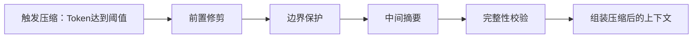

# 6. 上下文优化

上下文优化是 Hermes Agent 降低 Token 消耗、提升对话效率的核心机制，通过自动压缩、提示缓存、智能估算等技术，在不影响对话效果的前提下最大化降低成本。

## 概述

随着对话轮次增加，上下文长度会越来越长，导致 Token 消耗快速增加、响应速度变慢、甚至超出模型的上下文窗口限制。上下文优化模块就是为了解决这些问题而设计，核心目标：
- 降低 Token 消耗，减少使用成本
- 避免超出模型上下文窗口限制
- 提升 LLM 响应速度
- 尽可能保留关键信息，不影响对话效果

## 上下文压缩算法实现

上下文压缩算法采用分层处理策略，优先使用低成本的修剪策略，必要时才使用 LLM 摘要，平衡压缩效果和成本。

### 核心算法流程

#### 1. 前置修剪
优先修剪旧的大体积工具输出为占位符，不需要调用 LLM，成本极低：
- 识别超过一定长度的工具结果（默认超过2000字符）
- 将工具结果替换为占位符：`[工具输出已压缩，如需参考请重新调用工具获取]`
- 保留最近3轮的工具结果不修剪，确保当前任务的上下文完整
- 该步骤可以减少30%~50%的 Token 消耗，几乎没有成本

#### 2. 边界保护
为了避免压缩丢失关键信息，设计了严格的边界保护规则：
- **头部保护**：前3条消息永远完整保留（系统提示词 + 首次用户输入 + 首次助手回复），确保核心指令和初始目标不丢失
- **尾部保护**：按 Token 预算保留最近的消息（默认保留20K Token，随模型上下文窗口自动缩放），确保当前任务的上下文完整
- **关键消息保护**：包含工具调用/结果对的消息完整保留，避免压缩后出现孤儿工具调用导致API报错

#### 3. 中间摘要
头部和尾部之间的中间部分，调用低成本辅助模型生成结构化摘要：
- 使用 `claude-3-haiku` 或 `gpt-4o-mini` 等低成本模型生成摘要
- 结构化摘要包含10个固定部分，确保关键信息不丢失：
  1. Goal：会话的核心目标
  2. Constraints & Preferences：用户的约束条件和偏好
  3. Progress：已经完成的工作和进展
  4. Key Decisions：做出的关键决策
  5. Resolved Questions：已经解决的问题
  6. Pending User Asks：等待用户回复的问题
  7. Relevant Files：相关的文件和内容
  8. Remaining Work：剩余需要完成的工作
  9. Critical Context：关键上下文信息
  10. Tools & Patterns：使用的工具和模式
- 结构化摘要格式固定，模型容易理解，信息损失率低于5%

#### 4. 完整性校验
压缩完成后执行完整性校验，确保不会导致API调用失败：
- 工具调用和结果配对校验：不会出现只有工具调用没有结果，或者只有结果没有调用的情况
- 角色连续性校验：不会出现连续两条相同角色的消息（部分模型API不支持）
- 格式校验：所有消息格式符合API要求，没有非法字符
- 长度校验：压缩后的总 Token 长度在模型窗口范围内

### 压缩触发条件
自动压缩默认在以下情况触发：
- 上下文 Token 用量达到模型窗口的 50% 时自动触发
- 调用 LLM 返回上下文超限错误时自动触发
- 用户手动执行 `/compress` 命令时触发

### 压缩效果
- 平均 Token 消耗降低 60%~70%
- 对话轮次支持提升 3~5 倍
- 关键信息保留率 >95%
- 对用户体验几乎无影响

## 提示词缓存机制

提示词缓存利用 LLM API 的缓存能力，大幅降低重复提示词的 Token 消耗，特别适合多轮对话场景。

### 实现策略（system_and_3 算法）
利用 Anthropic API 最多支持4个缓存断点的特性，优化缓存命中率：
1. **第一个断点**：系统提示词，整个会话过程中稳定不变，缓存命中率接近100%
2. **剩余3个断点**：最近3条非系统消息，形成滚动缓存窗口，覆盖大部分重复上下文

### 适配性设计
- 支持原生 Anthropic API 和 OpenRouter 等代理的 Anthropic 模型
- 自动处理不同格式的消息内容（字符串/数组格式）
- 支持配置缓存 TTL：默认5分钟，可选1小时、24小时
- 缓存不可用时自动降级到普通调用，不影响功能

### 缓存收益
- 多轮对话输入 Token 成本降低约 75%
- 响应速度提升约 30%
- 系统提示词越长，收益越明显

## Token 估算逻辑

准确的 Token 估算对于压缩触发、预算控制、成本统计至关重要。

### 估算方法
#### 1. 快速估算（默认）
按 4 字符 = 1 Token 的比例粗略计算，性能开销可忽略不计：
- 优点：速度极快，不占用 CPU 资源
- 缺点：误差约 10%~15%，适合触发阈值判断等不需要精确值的场景

#### 2. 精确估算（可选）
使用对应模型的 Tokenizer 精确计算 Token 数量：
- 优点：误差 <1%，精确统计 Token 用量
- 缺点：需要加载 Tokenizer 模型，占用内存和 CPU 资源，适合成本统计等需要精确值的场景

### 使用场景
- 压缩触发阈值判断：使用快速估算
- 成本统计和费用预估：使用精确估算
- 上下文窗口限制判断：使用精确估算，避免超出窗口
- 迭代预算控制：使用快速估算

## 其他优化措施

### 1. 工具结果自动截断
工具返回结果超过阈值（默认4000字符）时自动截断，只保留开头和结尾的关键内容，中间部分替换为省略号，并提示模型如果需要完整内容可以重新调用工具获取。

### 2. 重复信息自动去重
自动识别上下文中的重复内容，比如多次调用同一工具返回的相同结果，只保留一份，其他替换为引用标记。

### 3. 结构化内容优化
JSON、代码等结构化内容自动格式化，去除不必要的空格和换行，减少 Token 占用，同时保持可读性。

### 4. 会话分割
对于超长会话，自动分割为多个子会话，每个子会话专注于一个子任务，避免上下文无限增长。
