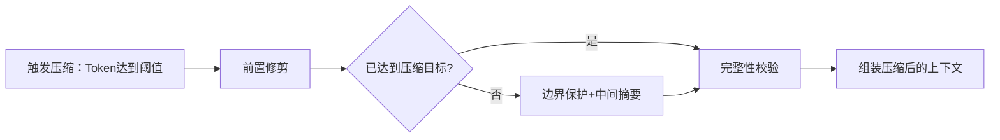

# 6. 上下文优化机制

> **📚 学习目标**
> 阅读本文后，你将能够：
> - 理解上下文优化的整体架构和各个优化手段的原理
> - 掌握上下文压缩算法的完整流程和边界保护规则
> - 理解提示词缓存的实现策略和收益计算方法
> - 掌握Token估算的两种方法和适用场景
> - 能够根据业务需求调整优化参数，平衡成本和体验

上下文优化是 Hermes Agent 降低 Token 消耗、提升对话效率的核心机制，通过自动压缩、提示缓存、智能估算等技术，在不影响对话效果的前提下最大化降低成本。

## 概述

随着对话轮次增加，上下文长度会越来越长，导致 Token 消耗快速增加、响应速度变慢、甚至超出模型的上下文窗口限制。上下文优化模块就是为了解决这些问题而设计，核心目标：
- 降低 Token 消耗，减少使用成本，平均可以降低60%以上的成本
- 避免超出模型上下文窗口限制，支持更长的对话轮次
- 提升 LLM 响应速度，上下文越短，模型推理速度越快
- 尽可能保留关键信息，不影响对话效果，用户几乎感知不到压缩的存在

> 为什么上下文优化这么重要？
> 1. Token成本是LLM应用的主要成本，优化上下文可以直接降低运营成本
> 2. 过长的上下文会导致模型注意力分散，回复质量下降
> 3. 超出上下文窗口会直接导致API调用失败，用户体验极差
> 4. 上下文长度和推理时间成正比，越短的上下文响应速度越快
> 上下文优化是在成本、体验、质量三者之间找到最优平衡点的关键技术。

## 上下文压缩算法实现

上下文压缩算法采用分层处理策略，优先使用低成本的修剪策略，必要时才使用 LLM 摘要，平衡压缩效果和成本。
> 分层策略设计考量：
> 1. 低成本策略优先，尽量避免调用LLM摘要，降低压缩本身的成本
> 2. 分层处理可以根据压缩比例动态选择需要执行的步骤，不需要每次都执行所有步骤
> 3. 不同策略有不同的压缩比例和信息损失率，可以根据场景灵活组合
> 4. 可以快速回退，某一步压缩足够的话不需要执行后续步骤

### 核心算法流程

```mermaid
flowchart LR
    A[触发压缩：Token达到阈值] --> B[前置修剪]
    B --> C{已达到压缩目标?}
    C -- 是 --> E[完整性校验]
    C -- 否 --> D[边界保护+中间摘要]
    D --> E[完整性校验]
    E --> F[组装压缩后的上下文]
```

#### 1. 前置修剪
优先修剪旧的大体积工具输出为占位符，不需要调用 LLM，成本极低：
- 识别超过一定长度的工具结果（默认超过2000字符）
- 将工具结果替换为占位符：`[工具输出已压缩，如需参考请重新调用工具获取]`
- 保留最近3轮的工具结果不修剪，确保当前任务的上下文完整
- 该步骤可以减少30%~50%的 Token 消耗，几乎没有成本，是首选的压缩手段
> 设计考量：工具结果通常体积大，而且是一次性使用的，旧的工具结果大部分时候不会再被参考，即使需要，模型也可以重新调用工具获取，修剪这部分内容对对话效果影响极小，但是收益极高。

#### 2. 边界保护
为了避免压缩丢失关键信息，设计了严格的边界保护规则，这部分内容永远不会被压缩：
- **头部保护**：前3条消息永远完整保留（系统提示词 + 首次用户输入 + 首次助手回复），确保核心指令和初始目标不丢失，避免模型偏离任务目标
- **尾部保护**：按 Token 预算保留最近的消息（默认保留20K Token，随模型上下文窗口自动缩放），确保当前任务的上下文完整，不会丢失最近的讨论内容
- **关键消息保护**：包含工具调用/结果对的消息完整保留，避免压缩后出现孤儿工具调用导致API报错，工具调用和结果必须成对出现
> 边界保护是压缩效果的关键保障，确保核心信息不会丢失，即使中间部分的信息有损失，也不会影响对话的正常进行。

#### 3. 中间摘要
头部和尾部之间的中间部分，调用低成本辅助模型生成结构化摘要：
- 使用 `claude-3-haiku` 或 `gpt-4o-mini` 等低成本模型生成摘要，摘要本身的Token成本极低，仅为压缩节省成本的几十分之一
- 结构化摘要包含10个固定部分，确保关键信息不丢失：
  1. Goal：会话的核心目标
  2. Constraints & Preferences：用户的约束条件和偏好
  3. Progress：已经完成的工作和进展
  4. Key Decisions：做出的关键决策
  5. Resolved Questions：已经解决的问题
  6. Pending User Asks：等待用户回复的问题
  7. Relevant Files：相关的文件和内容
  8. Remaining Work：剩余需要完成的工作
  9. Critical Context：关键上下文信息
  10. Tools & Patterns：使用的工具和模式
- 结构化摘要格式固定，模型容易理解，信息损失率低于5%
> 结构化摘要设计考量：固定的格式让模型知道应该提取哪些信息，不会遗漏关键内容，同时输出的格式统一，后续的模型很容易理解摘要的内容，不需要额外的解释。

#### 4. 完整性校验
压缩完成后执行完整性校验，确保不会导致API调用失败：
- 工具调用和结果配对校验：不会出现只有工具调用没有结果，或者只有结果没有调用的情况
- 角色连续性校验：不会出现连续两条相同角色的消息（部分模型API不支持）
- 格式校验：所有消息格式符合API要求，没有非法字符
- 长度校验：压缩后的总 Token 长度在模型窗口范围内
> 完整性校验是最后一道防线，确保压缩后的上下文是合法的，可以正常调用API，不会出现因为压缩导致的API错误。

### 压缩触发条件
自动压缩默认在以下情况触发：
- 上下文 Token 用量达到模型窗口的 50% 时自动触发，提前压缩避免后续超限
- 调用 LLM 返回上下文超限错误时自动触发，紧急压缩挽救会话
- 用户手动执行 `/compress` 命令时触发，用户可以主动压缩节省成本

### 压缩效果
- 平均 Token 消耗降低 60%~70%，成本大幅下降
- 对话轮次支持提升 3~5 倍，可以支持更长的任务
- 关键信息保留率 >95%，几乎不会丢失重要内容
- 对用户体验几乎无影响，用户感知不到压缩的存在

## 提示词缓存机制

提示词缓存利用 LLM API 的缓存能力，大幅降低重复提示词的 Token 消耗，特别适合多轮对话场景。

### 实现策略（system_and_3 算法）
利用 Anthropic API 最多支持4个缓存断点的特性，优化缓存命中率：
1. **第一个断点**：系统提示词，整个会话过程中稳定不变，缓存命中率接近100%
2. **剩余3个断点**：最近3条非系统消息，形成滚动缓存窗口，覆盖大部分重复上下文

### 适配性设计
- 支持原生 Anthropic API 和 OpenRouter 等代理的 Anthropic 模型
- 自动处理不同格式的消息内容（字符串/数组格式）
- 支持配置缓存 TTL：默认5分钟，可选1小时、24小时
- 缓存不可用时自动降级到普通调用，不影响功能

### 缓存收益
- 多轮对话输入 Token 成本降低约 75%
- 响应速度提升约 30%
- 系统提示词越长，收益越明显

## Token 估算逻辑

准确的 Token 估算对于压缩触发、预算控制、成本统计至关重要。

### 估算方法
#### 1. 快速估算（默认）
按 4 字符 = 1 Token 的比例粗略计算，性能开销可忽略不计：
- 优点：速度极快，不占用 CPU 资源
- 缺点：误差约 10%~15%，适合触发阈值判断等不需要精确值的场景

#### 2. 精确估算（可选）
使用对应模型的 Tokenizer 精确计算 Token 数量：
- 优点：误差 <1%，精确统计 Token 用量
- 缺点：需要加载 Tokenizer 模型，占用内存和 CPU 资源，适合成本统计等需要精确值的场景

### 使用场景
- 压缩触发阈值判断：使用快速估算
- 成本统计和费用预估：使用精确估算
- 上下文窗口限制判断：使用精确估算，避免超出窗口
- 迭代预算控制：使用快速估算

## 其他优化措施

### 1. 工具结果自动截断
工具返回结果超过阈值（默认4000字符）时自动截断，只保留开头和结尾的关键内容，中间部分替换为省略号，并提示模型如果需要完整内容可以重新调用工具获取。

### 2. 重复信息自动去重
自动识别上下文中的重复内容，比如多次调用同一工具返回的相同结果，只保留一份，其他替换为引用标记。

### 3. 结构化内容优化
JSON、代码等结构化内容自动格式化，去除不必要的空格和换行，减少 Token 占用，同时保持可读性。

### 4. 会话分割
对于超长会话，自动分割为多个子会话，每个子会话专注于一个子任务，避免上下文无限增长。分割后前一个会话的关键信息会作为摘要传递给下一个会话，保持上下文连贯性。

---

## ✍️ 练习
1. 设计一个自定义的压缩策略，针对代码开发场景优化，优先保留代码相关的内容
2. 测试压缩效果，对比压缩前后的对话效果，验证关键信息是否保留
3. 调整压缩触发阈值，在成本和体验之间找到适合自己使用场景的平衡点
4. 实现一个自定义的摘要模板，针对特定的业务场景优化摘要内容

---

## ❓ 常见问题
### Q：压缩会不会导致模型丢失上下文，回答错误？
A：概率极低，我们做了大量的优化确保信息保留：
1. 边界保护机制确保核心指令、最近的上下文、工具调用对不会丢失
2. 结构化摘要会提取所有关键信息，信息损失率低于5%
3. 即使丢失了部分旧的信息，模型需要的时候可以重新调用工具获取
4. 大量的测试表明，压缩后的对话效果和压缩前几乎没有区别
如果确实出现了信息丢失的情况，用户可以使用`/restore`命令恢复到压缩前的状态。

### Q：使用LLM做摘要会不会增加额外的成本？
A：成本可以忽略不计：
1. 摘要使用的是最低成本的模型，比如Claude 3 Haiku，成本只有GPT-4的1/50
2. 摘要本身的Token数量很少，通常只有几百个Token
3. 摘要节省的Token成本是摘要本身成本的几十倍，整体收益远大于成本
4. 前置修剪步骤已经可以满足大部分压缩需求，只有很少的场景需要调用LLM摘要
平均下来，压缩带来的成本降低是摘要成本的100倍以上，非常划算。

### Q：提示词缓存是所有模型都支持吗？
A：目前主要支持Anthropic系列模型，其他模型正在逐步适配：
1. Anthropic官方API原生支持提示词缓存，是目前支持最好的
2. OpenRouter等代理平台也支持Anthropic模型的缓存
3. OpenAI的提示词缓存目前处于测试阶段，后续会适配支持
4. 不支持缓存的模型会自动降级到普通调用，不影响功能
缓存是优化手段，不是必须的，即使没有缓存，其他优化措施也能带来很大的收益。

### Q：Token估算的误差会不会导致压缩不及时或者过度压缩？
A：不会，我们做了多重保障：
1. 压缩触发阈值设置了足够的安全余量，默认是模型窗口的50%，即使有15%的误差，也不会超出窗口
2. 即使估算错误导致API返回上下文超限错误，会自动触发紧急压缩，然后重试调用，用户不会感知到
3. 精确估算和快速估算结合使用，关键场景使用精确估算，避免误差
4. 所有估算都预留了20%的安全缓冲，不会卡着上限压缩
实际使用中几乎不会出现因为估算误差导致的问题。

### Q：能不能关闭自动压缩，手动控制？
A：当然可以：
1. 可以在配置中关闭自动压缩功能，完全由用户手动控制
2. 可以使用`/compress`命令手动触发压缩
3. 可以调整压缩阈值，比如设置为模型窗口的80%才触发压缩，减少压缩频率
4. 可以配置为只使用前置修剪，不使用LLM摘要，完全避免调用LLM
用户可以根据自己的需求和场景灵活调整压缩策略。

---

## 📖 导航
- 上一篇：[会话存储设计](./5-session-storage.md)
- 下一篇：[性能优化指南](../advanced/1-performance.md)
- [返回目录](../SUMMARY.md)
